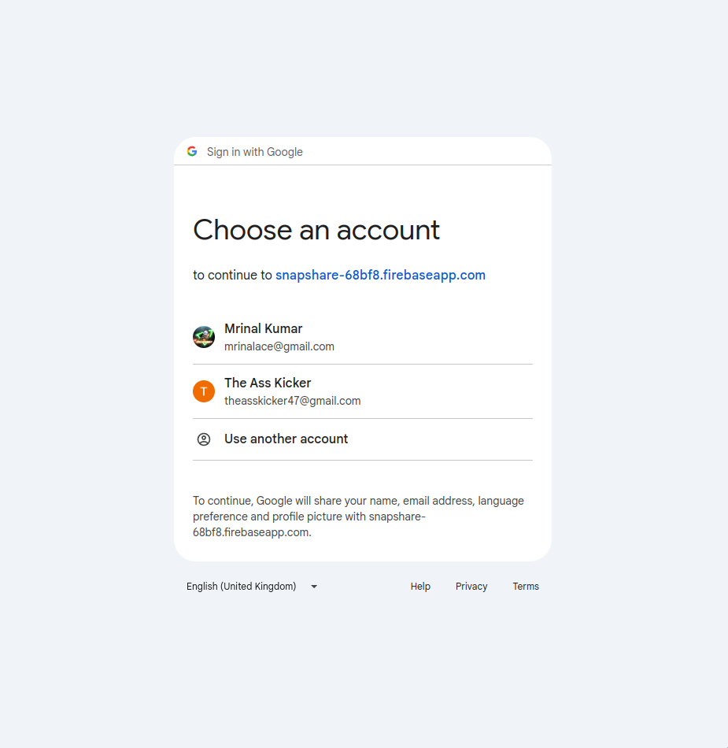
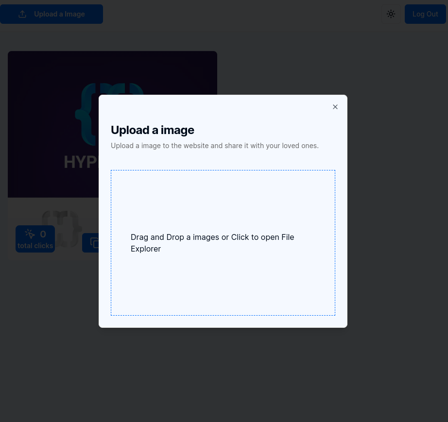

### SnapShare

SnapShare is a modern web application built with Next.js and Firebase that allows users to capture, share, and cherish their memories with loved ones. The app provides a seamless and secure way to upload and manage images, ensuring that every moment is easily accessible and beautifully presented. Whether you want to keep track of your personal photo collection or share memorable events with friends and family, SnapShare makes it simple and enjoyable.

**Features:**

- **User Authentication**: Secure sign-in with Google using Firebase Authentication.
- **Image Upload**: Effortlessly upload and store your images in Firebase Storage.
- **Image Gallery**: View your uploaded images in a clean, organized gallery.
- **Responsive Design**: Enjoy a smooth experience on both desktop and mobile devices.
- **Real-time Updates**: Automatically refresh the gallery to display new uploads instantly.
- **Image Management**: Copy image links, view click counts, and delete images with ease.

**Technologies Used:**

- **Frontend**: Next.js, React, TypeScript, Tailwind CSS
- **Backend**: Firebase Authentication, Firebase Storage, Firebase Firestore
- **State Management**: React Context API, useState, useEffect
- **UI Components**: Custom reusable components for buttons, cards, and images

**Getting Started:**

1. **Clone the repository**: 
   ```
   git clone https://github.com/McACE007/SnapShare.git
   ```

2. **Install dependencies**:
   ```
   cd SnapShare
   npm install
   ```

3. **Set up Firebase**:
   - Create a Firebase project.
   - Add Firebase configuration to your project.
   - Enable Google Authentication and Firestore in the Firebase console.

4. **Run the development server**:
   ```
   npm run dev
   ```

5. **Open your browser**: 
   Navigate to `http://localhost:3000` to view the application.

6. **Screenshots**:

| Sign In Page | Sign In Popup |
|------|-------|
|||

| Dashboard  | Upload Modal |
|------|-------|
|||

| Dashboard After Upload | Dashboard in Dard Mode |
|------|-------|
|||
